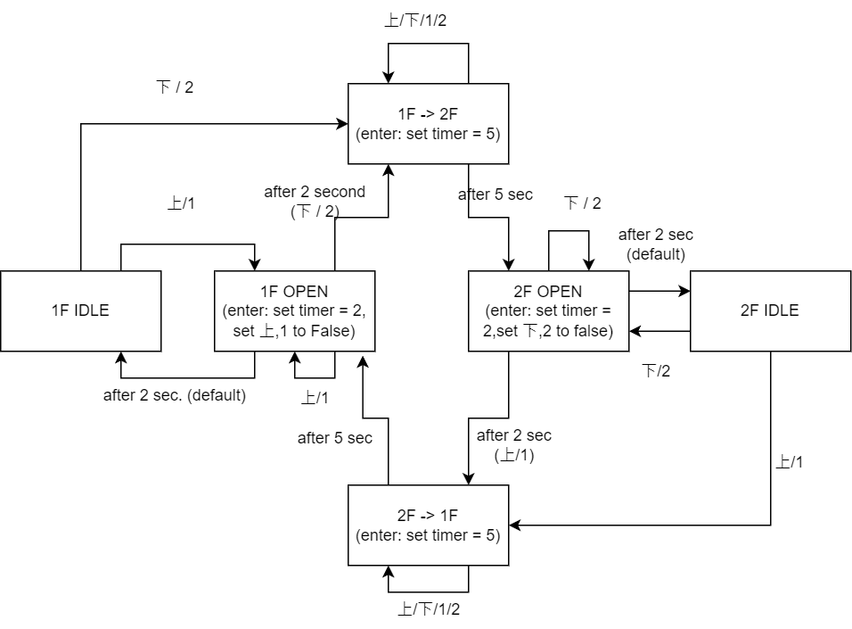

# ElevatorSimulator




## Usage

```
g++ -o controller.exe .\controller.cpp .\elevator.cpp .\state.cpp -lws2_32
g++ -o user.exe .\user.cpp -lws2_32
```

Run `controller.exe` before `user.exe` to setup server .


## 說明

使用 state pattern 實作狀態轉換，state 物件定義不同狀態之間轉換的邏輯和狀態對應的操作，elevator 物件持有資源並委派 state 進行狀態相關的操作。

`user.cpp`: 將使用者的指令直接傳給 `controller`

`controller.cpp` 包含三個 thread：

- `main`: 接收使用者的指令並按下按鈕
- `control_elevator`: 電梯狀態更新
- `show_elevator_status`: 定時顯示電梯的狀態

按鈕以長度為 4 的 bool array 儲存。使用者按下按鈕後，按鈕對應的值會設為 true；當電梯進入1樓開門時會將向上和1樓的按鈕重設為 false，進入2樓開門時候將向下和2樓的按鈕重設為 false。


## Synchronization

`elevator` 有兩項資源可能會被不同的 thread 同時讀取或修改：

- `button`: `show_elevator_status` 讀取、`control_elevator`修改、`main` 修改
- `curr_state`: `show_elevator_status` 讀取、`control_elevator`修改

在以上讀取或修改發生的位置加上 lock 保護，避免同時修改或是讀取到修改中的資源。